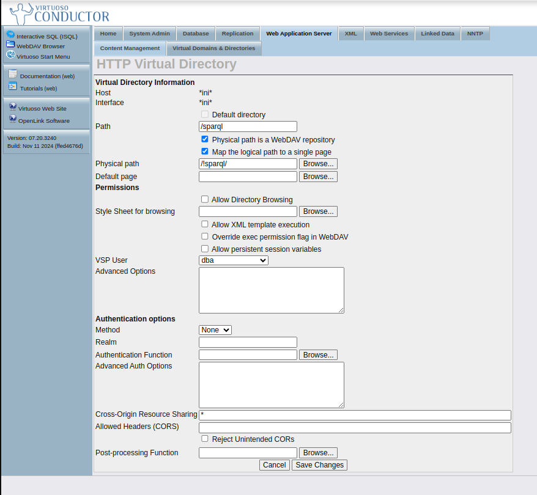

<!--
SPDX-FileCopyrightText: 2025 2025 Idiap Research Institute <contact@idiap.ch>
SPDX-FileContributor: Delmas Maxime maxime.delmas@idiap.ch
SPDX-License-Identifier: gpl-3.0-or-later.txt
-->

# ABRoad-KG-store (demo)

## Setting up the KG

### Docker image

Pull the image
```{bash}
docker pull openlink/virtuoso-opensource-7
```

### Download the demo data

You can find the demo data at [link](https://zenodo.org/records/15481114).
The directory contains all the triples and loading files to mount the Virtuoso triple-store.

Save the data into a directory like `/path/to/data/dir`
This directory should contain the sub-directory `import` containing the data and the loading files, like:

`/path/to/data/dir`
```
├── import
│   ├── vocabularies
│   │   ├── abroad.owl
│   │   ├── chebi_lite.owl
│   │   ├── cheminf.owl
│   │   ChunkNPR
│   │   │   supp-test-hits
│   │   │   ├── chunks_re.ttl.gz
│   │   │   ├── void.ttl
│   │   Chemical-activity-evidences
│   │   │   supp-test-hits
│   │   │   ├── activity_evidence.ttl.gz
│   │   │   ├── void.ttl
│   ├── load_voc.sh
│   ├── settings.sh
│   ├── upload_Resource-1_version-X1.sh
│   ├── upload_Resource-2_version-X2.sh
│   ├── ...
│   ├── update.sh
```


## Mount the Virutoso triple-store

To mount the Virtuoso triple-store, please use the following bash command:

`-d` indicates the path to the directory containing the data downloaded before.
`-c`: `start` to mount the triple-store and `clean` to unmount the triple-store. After `-c`, when using `start` all loading files are presented sequentially. Note that `settings.sh` and `load_voc.sh` should be on top the list, and, `update.sh` at the end.

```bash
bash workflow/w_virtuoso.sh -d  /path/to/data/dir/ \
    -c start settings.sh load_voc.sh upload_PubMed_supp-test-hits.sh upload_LOTUS_2023-01-06.sh upload_TiabFetchedDocumentDiscusses_supp-test-hits.sh upload_TiabNPR_supp-test-hits.sh upload_ChunkNPR_supp-test-hits.sh upload_gbif-taxonomy_28-08-2023.sh upload_identification_test-hits-supp.sh upload_PubMed_only-lotus.sh upload_Chemical-activity-evidences_supp-test-hits.sh upload_Organism-activity-evidences_supp-test-hits.sh update.sh
```


To stop the triple-store, use the following:
```
bash workflow/w_virtuoso.sh -d /path/to/data/dir -c clean
```

### Checking before using.

Before launching the web-interface (see repository: [abroad-demo-webapp](https://github.com/idiap/abroad-demo-webapp)), check the following:

#### Check the CORS (for the UI)

In the Virtuoso conductor panel accessible by default at `http://localhost:8890/`

* Go to conductor
* Log with Account: `dba` and password: `abroad`
* Go to `Web Application Server` > `Virtual Domains & Directories`
* Select the `Default Web Site` at port `8890` (by default)
* Go to `/sparql` > `Edit`
* Check that `Cross-Origin Resource Sharing` is with "*"




Done ! The server should be now on and ready !

Go to repository: [abroad-demo-webapp](https://github.com/idiap/abroad-demo-webapp) to see now how to launch the web-app.

